```mermaid
flowchart TD

%% ══════════ ONCE ══════════
subgraph ESKI["❶ ÖNCE — kurallar koda gömülüydü"]
  direction TB
  P0["preflight.py<br/>351 satir<br/>~30 kural if/else icinde"]
  S0["server.py<br/>try/except zincirleri<br/>sabit toleranslar"]
  N0["native_step.py<br/>sabit esikler"]
  SE0["semantic_check.py<br/>sabit model listesi"]
  OLU(["9 OLU KURAL<br/>_check_common<br/>cagiran yoktu"])
end

P0 -.->|"3f7809d · SILINDI<br/>davranis degismedi"| OLU

%% ══════════ DERLEME — acilista, bir kez ══════════
subgraph DERLE["⚙ DERLEME · acilista bir kez kosar"]
  direction LR
  D1["PARSE<br/>uc TOML okunur"]
  D2["CHECK<br/>her ad baglanabiliyor mu<br/>baglanamiyorsa SUNUCU ACILMAZ"]
  D3["RESOLVE<br/>kural adi ➜ yuklem fonksiyonu"]
  DP["CompiledPolicy<br/>InputPolicy · ExecutionPlan · OutputPlan"]
  D1 --> D2 --> D3 --> DP
end

INP -.-> D1
EXE -.-> D1
OUT -.-> D1

%% ══════════ AKIS ══════════
U(["KULLANICI<br/>dogal dil sorusu"]) --> MOD["MODEL<br/>soruyu tipli arac cagrisina cevirir"]
MOD --> LOG1[/"call_log · kayit acilir"/]
LOG1 --> REQ["ISTEK<br/>database · elements · composition<br/>conditions · axis · suspend"]

REQ --> PF{"❷ PREFLIGHT<br/>preflight.py · 179 satir<br/>SIFIR kural icerir<br/>5 sarmalayici devreder"}
DP -.->|"calisma ani YALNIZCA bunu okur<br/>isim aramasi yok"| PF
PF -->|"gecmedi"| RED["RED<br/>stop_rule ile cerceve<br/>+ route varsa ALTERNATIF"]
PF -->|"gecti"| PC{"❸ PRECONDITION<br/>bir hesaba mal olur"}
PC -->|"gecmedi"| RED
PC -->|"gecti"| IB["❹ GIRIS BAZI<br/>beyan edilen baz ➜ kanonik mol kesri<br/>MOTOR ONCESI · W(C)=0.01 ile X(C)=0.01<br/>FARKLI alasim"]
IB --> EX{"❺ EXECUTE<br/>run_cascade()"}
EX -.->|"kademe sirasi"| DP

EX --> RES["HAM SONUC<br/>fazlar · kesirler · G · kosullar"]
RES --> OB["❻ CIKIS BAZI<br/>kanonik sonuc + agirlikca %<br/>MOTOR SONRASI · sayiya dokunmaz,<br/>ikinci bazi EKLER"]
OB --> KA{"❼ KATMAN A<br/>result_check.py<br/>KARARI BU VERIR"}
KA -.-> LA
KA --> PASS["verification.passed<br/>◆ TEK KARAR NOKTASI ◆"]
PASS --> KB["❽ KATMAN B<br/>semantic_check.py<br/>bagimsiz model<br/>advisory_only = true"]
PASS --> OUTP{"❾ OZET + NOTLAR"}
OUTP -.-> DP
OUTP --> LOG2[/"call_log · tam yuk<br/>logs/calls.jsonl"/]
RED --> LOG2
LOG2 --> ANS(["CEVAP"])

%% ══════════ INPUT ══════════
subgraph INP["🟦 input.toml · 18.467 bayt · 4/4 BAGLI · cevabi DEGISTIREBILIR"]
  direction TB
  IA["accept · 3<br/>operations · defaults<br/>composition.basis"]
  IR1["reject · veritabani 2<br/>database-exists<br/>database-readable"]
  IR2["reject · bildirim 3<br/>elements-declared<br/>at-least-two-elements<br/>phases-declared"]
  IR3["reject · bilesim 3<br/>composition-non-negative<br/>composition-sum-positive<br/>composition-scale-plausible"]
  IR4["reject · ortam 2<br/>pressure-positive<br/>temperature-positive"]
  IR5["reject · sicaklik 4<br/>temperature-bounds-positive<br/>map-temperatures-positive<br/>seed-temperature-positive<br/>temperature-range-ordered"]
  IR6["reject · eksen 6<br/>axis-element-present +section<br/>axis-bounds-closed · half-open<br/>axis-range-ordered<br/>dependent-element-has-room"]
  IR7["reject · tarama+scheil 3<br/>seed-inside-mapped-range<br/>scheil-cools-downward<br/>scheil-min-temperature-positive"]
  IRT["route · 3<br/>section-needs-three-elements<br/>axis-upper-end-is-pure<br/>axis-leaves-no-dependent"]
  IPC["precondition · 1<br/>scheil-seed-is-liquid"]
end

%% ══════════ EXECUTION ══════════
subgraph EXE["🟦 execution.toml · 12.727 bayt · 7/10 BAGLI · cevabi DEGISTIREMEZ"]
  direction TB
  C1["equilibrium<br/>ocasi ➜ native_single"]
  C2["compare<br/>ocasi ➜ native_single"]
  C3["property_diagram<br/>native_step ➜ gap_fill ➜ python_loop"]
  C4["isothermal_section<br/>native_step ➜ gap_fill ➜ single_point_scan"]
  C5["scheil · native_scheil"]
  C6["phase_diagram · native_map"]
  EP["endpoint_recheck · tol 0.01"]
  GD["gap_detection · x3 aralik"]
  RB["reviewer + budget<br/>max_tokens 4000 · deadline 90s"]
  BIN["binary · order<br/>bundled_6058 ➜ built_6120<br/>BAGLANDI · sira degisince motor degisiyor"]
  IND["independence<br/>zayif bagimsizlik listesi"]
  EXC1["🟨 signals 10 · policy 4<br/>reviewer_note 4 · status=code<br/>ASLA TASINMAYACAK<br/>kod istisna TIPINE bakiyor"]
end

%% ══════════ KATMAN A ══════════
subgraph LA["🟨 result_check.py · 8 KONTROL · KODDA · kasitli"]
  direction TB
  V1["verify_result()<br/>bu duzgun bir sonuc mu"]
  V1a["check_phase_fraction_sums<br/>kesirler 1'e topluyor mu · NaN"]
  V1b["check_failed_points<br/>donenlerin kaci HATA verdi · %10"]
  V2["verify_correspondence()<br/>SORDUGUM sorunun cevabi mi"]
  V2a["check_requested_elements<br/>istedigim var mi<br/>ISTEMEDIGIM var mi"]
  V2b["check_mass_balance<br/>her elementin miktari tuttu mu"]
  V2c["check_suspended_phases_absent<br/>askiya aldigim faz gercekten yok mu"]
  V2d["check_requested_positions<br/>istenenlerin kaci HIC GELMEDI · %90"]
  V2e["check_reported_conditions<br/>motor BENIM kosullarimi mi kullandi"]
  V2f["check_degrees_of_freedom<br/>serbestlik derecesi 0 mi"]
  V1 --- V1a --- V1b
  V2 --- V2a --- V2b --- V2c --- V2d --- V2e --- V2f
end

%% ══════════ OUTPUT ══════════
subgraph OUT["🟦 output.toml · 18.868 bayt · 4/7 BAGLI · sayilara DOKUNAMAZ"]
  direction TB
  OD["derive · 5 turetme<br/>phase_regions · phase_transitions<br/>dominant_phase_regions<br/>melting_landmarks · under_sampled"]
  NOTE["note · 6 metin<br/>phase-name-is-structure-not-composition<br/>independent-review-objected<br/>gibbs-difference-is-not-a-ranking<br/>composition-was-rescaled<br/>mixed-basis-in-combined-scan<br/>scan-coverage-incomplete"]
  OS["stop_rule · 3<br/>on_route_present · on_no_route<br/>on_precondition"]
  OCV["conversion.axis_position<br/>eksen konumu + agirlikca %<br/>BUGUN BAGLANDI"]
  OT1["🟧 report 8 · honesty 8 · todo<br/>include_* hic uygulanmiyor<br/>honesty davranista DOGRU<br/>ama dosyadan okunmuyor"]
  OT2["🟧 floor 6 · planned<br/>TASIMA DEGIL, YENI IS<br/>korudugu 4 alanin 2'si YOK<br/>basis · source once yazilmali"]
  OT3["🟧 conversion.phase_amounts · planned<br/>faz miktarini kutleye cevirmek<br/>FAZ BILESIMI gerektiriyor<br/>yuk yalnizca molar amount tasiyor"]
end

KB -.->|"itiraz ederse KAYDEDILIR<br/>ve cercevelenir<br/>passed'a DOKUNMAZ"| NOTE

%% ══════════ TASIMA ══════════
P0  ==>|"bb47360<br/>Write the rules down<br/>~30 kural ➜ 25"| INP
S0  ==>|"634354a · tier order<br/>58fb990 · constants"| EXE
N0  ==>|"58fb990<br/>sabit esikler"| EXE
SE0 ==>|"58fb990<br/>hakem zinciri"| EXE
S0  ==>|"f3ab65c<br/>Wire the output side"| OUT

%% ══════════ KODDA KALAN ══════════
subgraph KALDI["🟨 KODDA KALDI — kasitli, tasinmayacak"]
  direction TB
  K1["result_check.py · 8 kontrol<br/>KARAR · kapatilabilir olmasi istenmez"]
  K2["15 yuklem<br/>check adlarinin kod karsiligi"]
  K3["8 sinyal · istisna TIPLERI<br/>tip Python'un dogrulayabildigi sey<br/>dosyadaki isim degil"]
  K4["4 makro uretec · 1.327 satir<br/>native_fallback · step · scheil · map<br/>KURAL DEGIL, IS"]
  K5["ayristirma<br/>motorun metin ciktisi<br/>regex · satir formatlari"]
end

P0 -->|"KALIR"| K1
S0 -->|"KALIR"| K4

%% ══════════ ACIK ══════════
subgraph ACIK["🟧 ACIKTA KALANLAR"]
  direction TB
  E4["KUSUR E4 · askiya alinmis faz + yedek motor<br/>faz askiya alma yalnizca OCASI'de<br/>OCASI duserse yedek giremez"]
  G3["KUSUR G3 · gaz fazi bilesimi<br/>element yerine MOLEKUL turu geliyor"]
  D1["BORC · server.py alti fonksiyon 1.077 satir<br/>build_combined_series tek basina 302"]
  D3["BORC · verification/validator.py<br/>AYRI Katman B kopyasi · max_tokens hala 1500"]
  D4["BORC · faz adi kanoniklestirme<br/>4 dosyada tekrar ediyor"]
  D5["TESHIS YOK · tam kosumda yavaslama<br/>5 kosumdur 1 vaka kaybi, her seferinde BASKASI<br/>elendi: pencere · artik surec · bellek<br/>yuk · kademe kodu · ayar motoru"]
end

%% ══════════ RENKLER ══════════
classDef eski  fill:#fee2e2,stroke:#ef4444,stroke-width:2px,color:#000
classDef yeni  fill:#dbeafe,stroke:#2563eb,stroke-width:2px,color:#000
classDef kod   fill:#fef3c7,stroke:#d97706,stroke-width:2px,color:#000
classDef acik  fill:#ffedd5,stroke:#ea580c,stroke-width:2px,color:#000
classDef gri   fill:#f3f4f6,stroke:#9ca3af,color:#000
classDef uc    fill:#dcfce7,stroke:#16a34a,stroke-width:3px,color:#000
classDef karar fill:#fde68a,stroke:#b45309,stroke-width:4px,color:#000

class ESKI,P0,S0,N0,SE0,OLU eski
class INP,IA,IR1,IR2,IR3,IR4,IR5,IR6,IR7,IRT,IPC yeni
class DERLE,D1,D2,D3,DP,IB,OB yeni
class EXE,C1,C2,C3,C4,C5,C6,EP,GD,RB,BIN,IND yeni
class OUT,OD,NOTE,OS,OCV yeni
class LA,V1,V1a,V1b,V2,V2a,V2b,V2c,V2d,V2e,V2f kod
class KALDI,K1,K2,K3,K4,K5,EXC1,KA kod
class PASS karar
class ACIK,E4,G3,OT1,OT2,OT3 acik
class KB gri
class U,ANS uc
```

# Derleyici mimarisi — tek diyagram

*2026-08-31. Her kutu dosyalardan okundu, hiçbiri hafızadan yazılmadı.*

---

## Okuma anahtarı

| | anlamı |
|---|---|
| **kalın ok** `==>` | kural buradan buraya **taşındı** — üstünde commit no |
| **düz ok** `-->` | çalışma anındaki akış |
| **kesik ok** `-.->` | okuma / danışma — karar taşımaz |
| 🟥 kırmızı | **ÖNCE**: kural koda gömülüydü |
| 🟦 mavi | **ŞİMDİ**: kural ayar dosyasında |
| 🟨 sarı | **KODDA KALDI**: kasıtlı, taşınmayacak |
| 🟧 turuncu | **AÇIK**: todo / planned / kusur |
| ⬜ gri | danışman — oy kullanmaz |

---



---

## Sayılarla

| | bağlı | açık | toplam |
|---|---|---|---|
| `input.toml` bölüm | **4** | 0 | 4 |
| `execution.toml` bölüm | **5** | 4 | 9 |
| `execution.toml` bölüm | **7** | 3 | 10 |
| `output.toml` bölüm | **4** | 3 | 7 |
| **toplam** | **15** | **6** | **21** |

Açık kalan 6'nın 3'ü `status = "code"` — gerçek iş **3 bölüm**
(`report`, `honesty`, `floor`).

| | |
|---|---|
| Ayar dosyasındaki bağlı kural | **42** |
| Katman A kontrolü (kodda, kasıtlı) | **8** |
| Motor kademesi | **6 işlem · 4 motor** |
| MCP aracı | **8** |
| Python | **14 modül · 6.817 satır** |
| TOML | **3 dosya · 43.816 bayt** |
| `preflight.py` | **351 → 179 satır · ~30 kural → 0** |
| Kıyaslama | **86/86** *(+2 belgelenmiş kusur)* |
| Fark testi | **633/633** |

---

## Diyagramın söylediği tek şey

Üç ayar dosyası aynı kaynağın üç ayrı **riskini** ayırıyor:

```
input.toml       cevabi DEGISTIREBILIR      -> dikkatle degistir
execution.toml   cevabi DEGISTIREMEZ        -> serbestce ayarla
                 ulasilirligi degistirir
output.toml      sayilara DOKUNAMAZ         -> guvenle degistir
```

Karar tek yerde: **`verification.passed`** — Katman A'da, kodda, kalın çerçeveli
kutuda. İkinci model danışıyor ama oy kullanmıyor; ölçüldü, `x(C)=0.01`'i
ağırlıkça %1 okuyup doğru sekiz sayıyı reddettirmişti.

Kod üretimi gerçek: dört üreteç OpenCalphad'ın makro dilini yazıyor, çıktısı
geri ayrıştırılıyor. Ara temsili dönüştüren bir geçiş yok — bu yüzden
**transpiler**, optimize eden derleyici değil.
