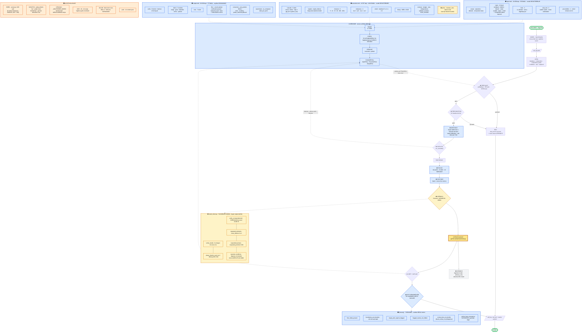

# Mevcut durum — tek diyagram

*2026-09-01 akşamı. Her kutu dosyalardan okundu, hiçbiri hafızadan yazılmadı.*

---

## Okuma anahtarı

| | anlamı |
|---|---|
| **düz ok** `-->` | çalışma anındaki akış |
| **kesik ok** `-.->` | okuma / danışma — karar taşımaz |
| 🟦 mavi | kural **ayar dosyasında**, açılışta derlenmiş |
| 🟨 sarı | **kodda**, kasıtlı — aritmetik, tip, ayrıştırma |
| ⬜ gri | danışman — oy kullanmaz |
| 🟧 turuncu | **açık** — kusur, borç ya da ölçülmemiş |

---



---

## Sayılarla

| | bağlı | açık | toplam |
|---|---|---|---|
| `input.toml` | **5** | 0 | 5 |
| `execution.toml` | **14** | 2 | 16 |
| `output.toml` | **7** | 0 | 7 |
| **toplam** | **26** | **2** | **28** |

Açık kalan iki bölüm `status = "code"`: `policy`'nin kuralı tip listesinin kendisi, `reviewer_note` bağlanacak davranışı olmayan bir operatör notu.

| | |
|---|---|
| Python | **14 modül · 8.158 satır** |
| TOML | **3 dosya · 68.996 bayt** |
| Ayar bölümü | **28 · 26'sı bağlı** |
| Katman A kontrolü | **8** — beyan dosyada, yüklem kodda |
| Çıktı değişmezi | **7** — anahtar değil kontrol |
| MCP aracı | **8** |
| Kıyaslama | **86/86** *(kolay 30/30 · orta 35/35 · zor 21/21)* — havuz 88, ikisi belgelenmiş kusur |
| Denetim | **dört yönlü**, temiz |
| Commit | **60** — bugün 13 |

---

## Dört değişmez

```
input.toml       cevabi DEGISTIREBILIR
                 ne hesaplanacak + reddedilirse ne yapilacak

execution.toml   cevabi DEGISTIREMEZ, ulasilirligi degistirir
                 hangi motor, hangi sirayla, ne kadar bekleyerek

output.toml      sayilara DOKUNAMAZ
                 [verify] dogru mu · [derive] ne turetilir
                 [floor] ne hep bulunur · [honesty] biz nasil davraniriz

kod              aritmetik, tip kontrolu, makro uretimi, ayristirma
                 kural degil IS
```

---

## Denetim — dört yön

```
1  dosyada var, kodda okuyan var mi
2  kodda kural govdesi kalmis mi
3  yurutucunun actigi her sey cagriliyor mu
4  okudugunu IDDIA EDEN gercekten okuyor mu     <- bugun eklendi
```

Dördüncüsü bugün iki sessiz düşüş yakaladı. Biri **doğru görünüyordu**: yedeği dosyadaki değerin aynısıydı, yani ayarı hiç okumadan doğru cevap veriyordu.

---

## Yavaşlamanın sebebi — ölçüldü

```
--hizli    141.1 s     Katman B kapali
tam       2915.8 s     Katman B acik

S2_ozet_erime_araligi   115.88 s   verify_b = 90.726 ms   %78
C3_steel1_genis_tarama  111.63 s   verify_b = 89.289 ms   %80
H1_krom_taramasi        104.02 s   verify_b = 90.698 ms   %87
```

Her birinde **tam 90 saniye** — `stage_deadline_s` tavanı. Hesap saniyeler, hakem 90 saniye.

```
zamanin %100'u   cagrilarin ICINDE
cagrilar arasi   %0
her arka uc      "sabit" -- zaman icinde bozulma YOK
```

Aylardır *"sebep bilinmiyor"* diye taşınan şeyin adı: **ulaşılamayan bir hakemi beklemek.** Koşumun %37'si.
