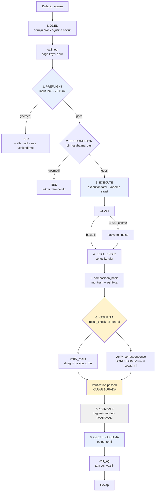
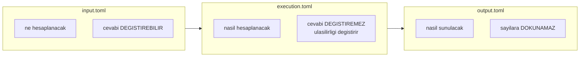
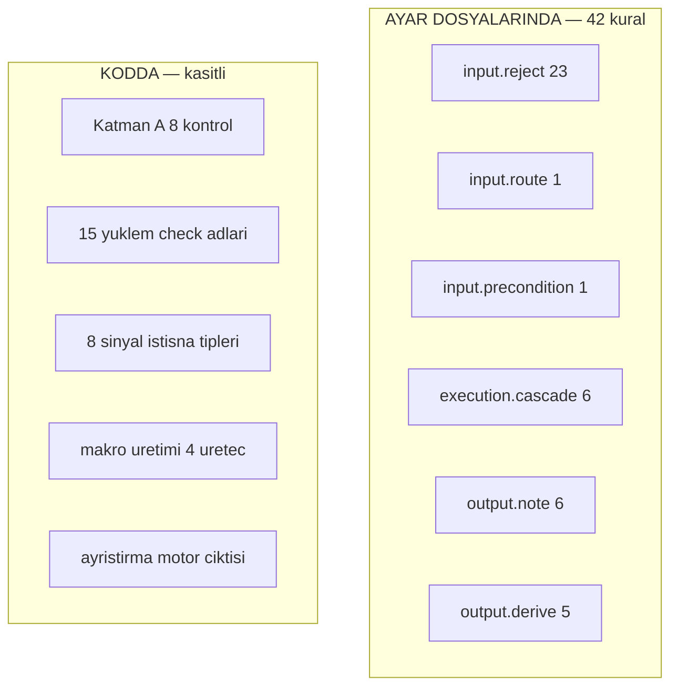
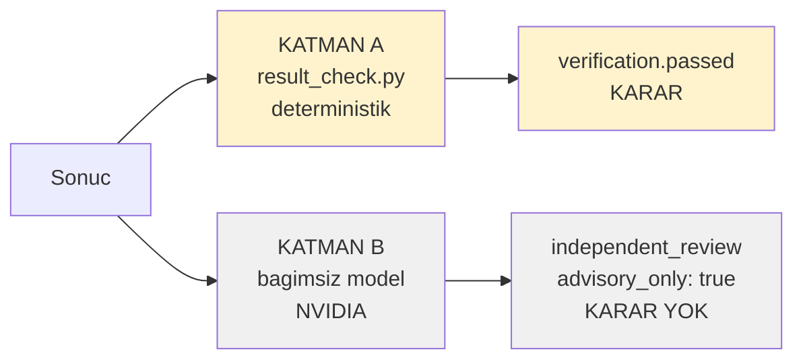
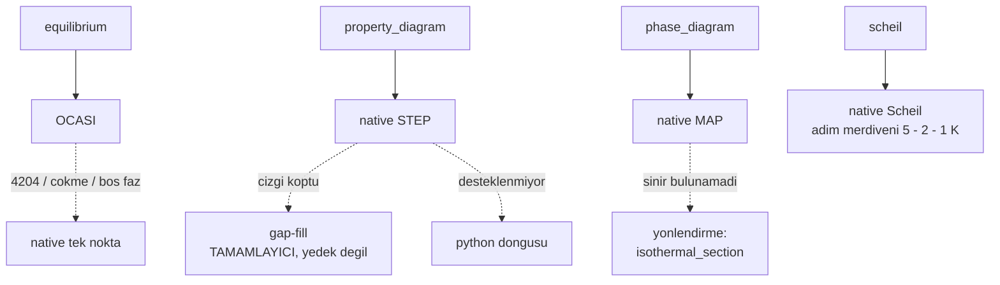

# Mimari — mevcut durum

*Ölçüm tarihi: 2026-08-31. Bu belge hafızadan değil, dosyalardan çıkarıldı.*

---

## Bir bakışta

```
14 modul          7.423 satir Python
 3 ayar dosyasi   50.062 bayt TOML
 8 MCP araci
 4 motor kademesi
21 ayar bolumu    15'i bagli
 8 kontrol        Katman A'da (kodda, kasitli)
```

**Ayarlar açılışta bir kez derleniyor.** Üç dosya `CompiledPolicy`'ye
çözülüyor ve çalışma anı yalnızca onu okuyor — kural adları isimle değil,
bağlandıkları fonksiyonla taşınıyor. Bilinmeyen bir ad sunucuyu açtırmıyor.

| | |
|---|---|
| Kıyaslama | **86/86** (2 belgelenmiş kusur ayrı) |
| Derleme | temiz — her ad bağlı, okunmayan anahtar yok |
| Fark testi | **633/633** (33 elle + 600 rastgele) |
| Ayar denetimi | temiz, iki yönlü |

---

## 1 · Akış



**Mavi** = kuralları ayar dosyasından okuyan aşamalar
**Sarı** = kararı veren aşama (kodda, kasıtlı)
**Gri** = danışman, karar vermez

---

## 2 · Üç ayar dosyası

Her birinin **tek cümlelik değişmezi** var. Ayrı dosya olmalarının sebebi bu — açan kişi ne tür bir riske baktığını bilir.



### `input.toml` — 16.253 bayt

*Bu istek çalıştırılabilir mi, ve tam olarak neyi hesaplayacağız?*

| bölüm | giriş | durum |
|---|---|---|
| `accept` | 3 | bağlı |
| `reject` | 23 | bağlı |
| `route` | 1 | bağlı |
| `precondition` | 1 | bağlı |

**4/4 bağlı.** Örnek:

```toml
[[reject]]
id      = "at-least-two-elements"
check   = "min_nonzero_count"
minimum = 2
message = "At least two elements with a nonzero amount are required..."
because = """
Saf {FE: 1.0} motoru 'One component without condition'a sokup cokertiyor,
900-1700 K arasi her sicaklikta test edildi."""
```

`check` bir **kod fonksiyonunun adı** — 15 yüklem `settings_engine`'de.
Aynı türde kural eklemek yalnızca bu dosya.

### `execution.toml` — 11.265 bayt

*Hangi motor, hangi sırayla, biri pes ederse ne olur?*

| bölüm | giriş | durum |
|---|---|---|
| `cascade` | 6 | bağlı |
| `endpoint_recheck` | 5 | bağlı |
| `gap_detection` | 2 | bağlı |
| `reviewer` | 2 | bağlı |
| `reviewer_budget` | 4 | bağlı |
| `signals` | 10 | `code` |
| `policy` | 4 | `code` |
| `reviewer_note` | 4 | `code` |
| `binary` | 5 | `todo` |

**5/9 bağlı, 3 asla bağlanmayacak, 1 yapılmadı.**

```toml
[[cascade]]
operation = "equilibrium"
tiers = [
  { handler = "ocasi", start = true },
  { handler = "native_single",
    on = ["did_not_converge", "engine_crashed", "no_stable_phases"],
    cannot_serve = ["phase_status"] },
]
```

**Ölçülmüş dayanağı:** `steel1 Fe-C 1000 K` iki motorda da `G = -41981.578`.
1200 K'de OCASI soğukken çözemiyor, native çözüyor. *Aynı cevap, ya da cevap yok — asla farklı bir cevap.*

`cannot_serve` bir sinyal değil: sinyal önceki kademenin neden pes ettiğini söyler, bu sonrakinin **ne yapamadığını**. Faz askıya alma yalnızca OCASI'de çalışır.

### `output.toml` — 17.607 bayt

*Gelen sonuç nasıl toparlanır, ne söylenir?*

| bölüm | giriş | durum |
|---|---|---|
| `derive` | 4 | bağlı |
| `note` | 6 | bağlı |
| `stop_rule` | 4 | bağlı |
| `conversion` | 5 | bağlı |
| `report` | 8 | `todo` |
| `honesty` | 8 | `todo` |
| `floor` | 6 | `planned` |

**4/7 bağlı.** `conversion` bugün bağlandı — ayrıntısı aşağıda.

---

## 3 · `status` — üç ayrı anlam

Bağlanmamış bir bölüm üç farklı şey olabilir. Dosya artık bunu söylüyor:

| değer | anlamı | bölümler |
|---|---|---|
| *(yok)* | kod okuyor, çalışıyor | 12 bölüm |
| `"code"` | **asla taşınmayacak** — burada belge, karar kodun | `signals`, `policy`, `reviewer_note` |
| `"todo"` | taşınabilir, yapılmadı | `binary`, `report`, `honesty` |
| `"planned"` | taşıma değil, **yeni iş** | `floor` |

**Neden `signals` asla taşınmayacak:** kod istisna **tipine** bakıyor (`NativeStepError` mi `NameError` mi). Bir tip Python'un doğrulayabildiği şey; dosyadaki bir isim değil. Dosyada yazılı olması iyi, bağlanması zayıflatır.

**Neden `floor` yeni iş:** koruduğu dört alanın ikisi (`basis`, `source`) henüz hiç yok. Var olmayan alan korunamaz.

`settings_audit.py` bu alandan okuyor — elle tutulan liste yok.

---

## 4 · Kurallar nerede



### Katman A'nın 8 kontrolü — `result_check.py`

**İki ayrı soru soruyor**, ve dosya bunu 100. satırda kendisi yazıyor:

**Soru 1 — `verify_result()`: "bu düzgün bir denge sonucu mu?"**

```
check_phase_fraction_sums     kesirler 1'e topluyor mu, [0,1], NaN
check_failed_points           donen noktalarin kaci HATA verdi   (%10)
```

**Soru 2 — `verify_correspondence()`: "bu, SORDUĞUM sorunun cevabı mı?"**

```
check_requested_elements      istedigim elementler var mi
                              ISTEMEDIGIM element var mi
check_mass_balance            her elementin miktari tuttu mu
check_suspended_phases_absent askiya aldigim faz gercekten yok mu
check_requested_positions     istenen konumlarin kaci HIC GELMEDI (%90)
check_reported_conditions     motor BENIM kosullarimi mi kullandi
check_degrees_of_freedom      serbestlik derecesi 0 mi
```

**Neden kodda:** *"faz kesirleri 1'e toplamalı"* ayarlanabilir bir şey değil.
Kapatılabilir olması istenmez. Aksi olursa o zaten sonuç değildir.

**Ve `input.toml`'un yerine geçmiyor:**

| `input.toml` (istek, motordan **önce**) | Katman A (sonuç, motordan **sonra**) |
|---|---|
| element veritabanında **tanımlı mı** | element sonuçta **gerçekten var mı** |
| — | **istenmeyen** element var mı |
| bileşim toplamı makul mü | her elementin **miktarı** tuttu mu |
| askıya alınacak faz tanımlı mı | askıya alınan faz **gerçekten yok mu** |
| sıcaklık pozitif mi | motor **benim** sıcaklığımı mı kullandı |
| — | faz kesirleri 1'e topluyor mu |
| — | serbestlik derecesi 0 mı |

Sağdaki dördü solda **olamaz** — ortada henüz sayı yokken sorulamazlar.

**Ölçülmüş kanıt:** `iron4cd`'de `FE, CR, C, NI` hepsi veritabanındaydı, PREFLIGHT geçti. Ama makro `set c` satırını bir isteme kaptırdı, motor `Degrees of freedom are 6` dedi ve `G = 0.0, NaN` döndürdü. PREFLIGHT'ın yakalaması **imkânsızdı** — istek kusursuzdu.

---

## 5 · Katman A ve Katman B



**Katman B neden karar vermiyor:** ikinci bir dil modeli, ve tam olarak modelin zayıf olduğu yerde zayıf — ezberi hesabın önüne koyuyor.

Ölçülmüş: `steel1 Fe-1at%C @ 1100 K` → `%7.5 ferrit + %92.5 östenit` döndü. A3'ün (1105 K) beş derece altında bu **doğru**. Hakem *"ötektoidin üstünde sadece östenit beklenir"* diyerek reddetti — çünkü `x(C)=0.01`'i **ağırlıkça %1** okudu. O alaşım `x(C)=0.045`, hiperötektoid, ve gerçekten östenit+karbür veriyor.

**Hakem yanlış hesaplamıyordu — başka bir alaşımı doğru hesaplıyordu.**

Model itiraza uydu ve kendi doğru sekiz sayısını reddetti. Şimdi itiraz kaydediliyor, çerçeveleniyor, ama `passed`'a dokunmuyor.

**Yine de yerini hak ediyor:** `LIQUID`/`LIQUID#1` isim ayrımını ve `alni-4slx`'in yakınsama oranını o buldu. İpucu değerlidir; hüküm değildir.

---

## 6 · Modül envanteri

| modül | satır | fonksiyon | ayar okuyor |
|---|---|---|---|
| `server.py` | 1632 | 22 | **evet** |
| `native_step.py` | 1057 | 20 | **evet** |
| `settings_engine.py` | 619 | 32 | *(kendisi)* |
| `native_map.py` | 471 | 6 | hayır |
| `native_fallback.py` | 461 | 6 | hayır |
| `result_check.py` | 429 | 12 | hayır |
| `semantic_check.py` | 418 | 8 | **evet** |
| `native_scheil.py` | 395 | 4 | hayır |
| `oc_service.py` | 394 | 8 | **evet** |
| `scan_summary.py` | 292 | 11 | **evet** |
| `preflight.py` | 179 | 7 | **evet** |
| `settings_audit.py` | 171 | 7 | **evet** |
| `call_log.py` | 150 | 5 | hayır |
| `failure_classify.py` | 149 | 2 | hayır |

### Ayar dosyalarına hiç girmeyenler — ve neden

```
native_fallback.py   461   makro uretir, motor ciktisini ayristirir
native_scheil.py     395   Scheil makrosu + ayristirma
native_map.py        471   MAP makrosu + sinir ayristirma
result_check.py      429   KATMAN A
failure_classify.py  149   hata siniflandirma
call_log.py          150   cagri kaydi
────────────────────────────────────────────────────────
                   2.055 satir
```

**Üç ayrı sebep:**

1. **Kural değil, iş** — üç `native_*` modülü makro metni üretiyor ve motor çıktısını ayrıştırıyor. Regex'ler, satır formatları, `set condition` sözdizimi. Taşınsa **okunmaz** hale gelir.
2. **Kural ama ayar değil** — Katman A. Kapatılabilir olması istenmez.
3. **Altyapı** — kayıt tutma, hata tipleme. Kimya kuralı değil.

### Kısmen girenler

```
server.py         alti buyuk fonksiyon KODDA (1077 satir)
                  notlar, stop_rule, kapsama DOSYADAN
native_step.py    build_combined_series (302 satir) KODDA
                  gap esigi, uc toleransi DOSYADAN
semantic_check.py hakem zinciri, butce DOSYADAN
                  istem metni, ayristirma KODDA
scan_summary.py   toleranslar DOSYADAN
                  turetme mantigi (~200 satir) KODDA
```

---

## 7 · Sekiz araç

| araç | satır | ne yapar |
|---|---|---|
| `list_databases` | 7 | TDB dosyalarını listeler |
| `inspect_database` | 12 | element ve faz adları |
| `calculate_equilibrium` | 103 | tek nokta denge |
| `compare_alloys` | 164 | iki bileşim, aynı koşul |
| `calculate_property_diagram` | 236 | sıcaklık taraması |
| `calculate_isothermal_section` | 243 | bileşim taraması |
| `calculate_scheil_solidification` | 159 | dengesiz katılaşma |
| `calculate_phase_diagram` | 172 | iki eksenli faz diyagramı |

---

## 8 · Motor kademeleri



**`gap_fill` bir yedek değil, tamamlayıcı.** STEP'in ulaşamadığı konumları ekliyor, ulaştıklarını **değiştirmiyor**. Bugüne kadar ikisi de aynı `except` bloğundaydı ve fark görünmüyordu.

**MAP'in ikinci kademesi yok** — bu motorda sınır izleyen başka bir şey yok. Düştüğünde dürüst cevap bunu söylemek ve alternatifi adlandırmak.

---

## 9 · Ne tamamlandı

```
tarama ozeti           gecis, baskinlik, erime, yetersiz orneklem
kapsama denetimi       "1/20 nokta, dogrulandi" artik uyariyor
composition_basis      mol kesri + agirlikca, her sonucta
Katman B danisman      yanlis itiraz sonucu dusurmuyor
PREFLIGHT yonlendirme  reddin yaninda alternatif
cagri kaydi            her cagri, tam yuk, logs/calls.jsonl
kurallar               koddan uc ayar dosyasina, 42 kural
iki yonlu denetim      settings_audit.py, her kosumda
eksen degerine birim   tarama konumlari artik iki bazi da tasiyor
```

**Eksen birimi (bugün).** Bir bileşim taraması konumları `x` adında çıplak
sayılar olarak veriyordu, ve `composition_basis` yalnızca taban bileşimi
tarif ediyordu — orada taranan element hâlâ sıfır. Ölçüldü (`1.29`): çağıran
taraf 25 konumu elle ağırlıkça yüzdeye çevirdi ve **hepsi düşük çıktı**;
nikel içinde durduğu alaşımdan ağır, yani dönüşüm ters yöne gitmişti.
`x(NI)=0.0333` gerçekte %3.55, %3.2 diye bildirildi, ve buradan *"%2–3
yeterli"* sonucu çıkarıldı — gerçekte %3.55 gerekiyordu.

Artık her nokta `x_weight_percent` taşıyor, her özet yer imi ikinci bazı da
veriyor, ve tarama `axis_basis = "mole_fraction"` diye etiketleniyor.
Dönüşüm `native_step.composition_at()` üzerinden yapılıyor — gap-fill'in
kullandığı fonksiyon — yani dönüştürülen alaşım motorun hesapladığının
aynısı. Ölçüldü: 195 gerçek tarama üzerinde **hiçbir mevcut alan
değişmedi**, yalnızca yedi yeni alan eklendi.

## 10 · Ne kaldı

### Bilinen kusurlar — kıyaslamada ayrı tutuluyor

```
E4   askiya alinmis faz + yedek motor
     faz askiya alma yalnizca OCASI'de; OCASI duserse yedek giremez
G3   gaz fazi bilesimi element yerine MOLEKUL turu olarak geliyor
```

### Ayar dosyalarında yapılacaklar

```
binary     todo      6.058 tercihi native_fallback.py'de sabit
report     todo      include_* bayraklari hic uygulanmiyor
honesty    todo      davranista dogru, dosyadan okunmuyor
floor      planned   basis/source alanlari once yazilmali
```

`conversion` bu listeden çıktı: `axis_position` bağlandı, `phase_amounts`
hâlâ `planned` çünkü faz miktarını kütleye çevirmek o fazın **kendi
bileşimini** gerektiriyor ve yük yalnızca `phase_molar_amounts` taşıyor.

### Kod borcu

```
server.py'nin alti fonksiyonu     1077 satir
build_combined_series               302 satir tek fonksiyon
verification/validator.py           AYRI Katman B, max_tokens hala 1500
faz adi kanoniklestirme             dort dosyada tekrar ediyor
```

### Açık teşhis

**Tam koşumdaki yavaşlama.** Beş koşumdur bir vaka kaybediliyor, her seferinde başkası, hepsi tek başına saniyeler içinde geçiyor. Elendi: başıboş gnuplot penceresi, artık Windows süreci, bellek, yük, kademe kodu, ayar motoru. **Sebep bilinmiyor.**

### Ölçüm

```
Blok 1    29 soru soruldu + 7 yeniden olcum
          8 soru kaldi: 1.21, 1.29, 1.30, 1.34-1.40
Blok 2-7  160 soru
```

---

## 11 · Doğrulama nasıl koşulur

```bash
# ayar dosyalari ile kod ayni seyi soyluyor mu (iki yonlu)
python settings_audit.py

# 88 vakalik kiyaslama, gercek MCP protokolu uzerinden
cd benchmark && python run.py

# tek grup
python run.py DOGRU_RED          # 31 red vakasi
python run.py DOGRU_RAPOR        # ozet alani vakalari
python run.py --hizli C1_agcu_otektik    # Katman B kapali, hizli

# bir modelin gercekten cevap verip vermedigi
bash model_test.sh nvidia/nemotron-3-ultra-550b-a55b
```

---

## 12 · Bu mimarinin özeti, tek paragrafta

Boru hattı derleyici biçimli: doğal dil bir **tipli isteğe** çevrilir, motor çalışmadan önce **statik bir denetim** imkânsızları eler, bir **kademe zinciri** sayıları üretir, ve sonuç çıkışta **denetlenip özetlenir**. Kod üretimi gerçekten var — dört üreteç OpenCalphad'ın makro dilini yazıyor, ve motorun metin çıktısı geri ayrıştırılıyor. Ara temsili dönüştüren bir geçiş yok, o yüzden bu bir **transpiler**, optimize eden bir derleyici değil. Kurallar üç ayar dosyasında yaşıyor, her birinin tek cümlelik bir değişmezi var, ve her kuralın yanında **neden var olduğu** yazılı — çünkü gerekçesi unutulmuş bir kural, kimsenin güvenle silemeyeceği bir kuraldır.
